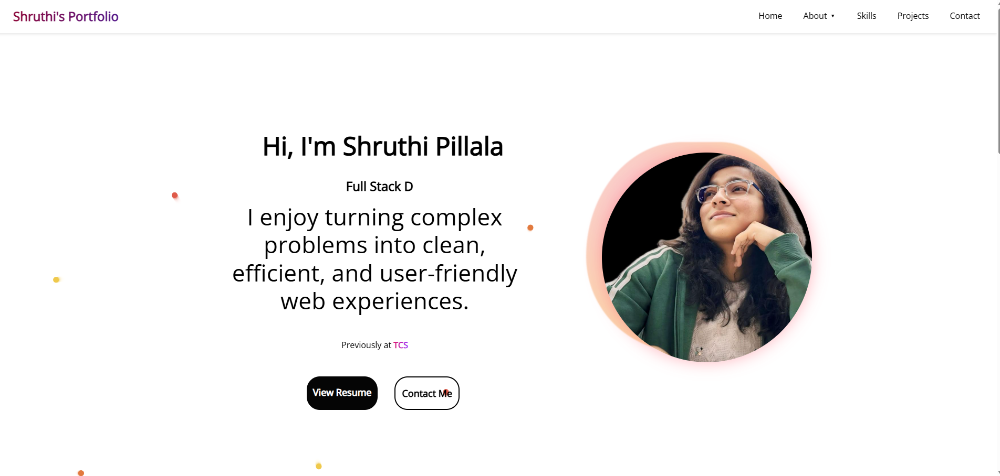
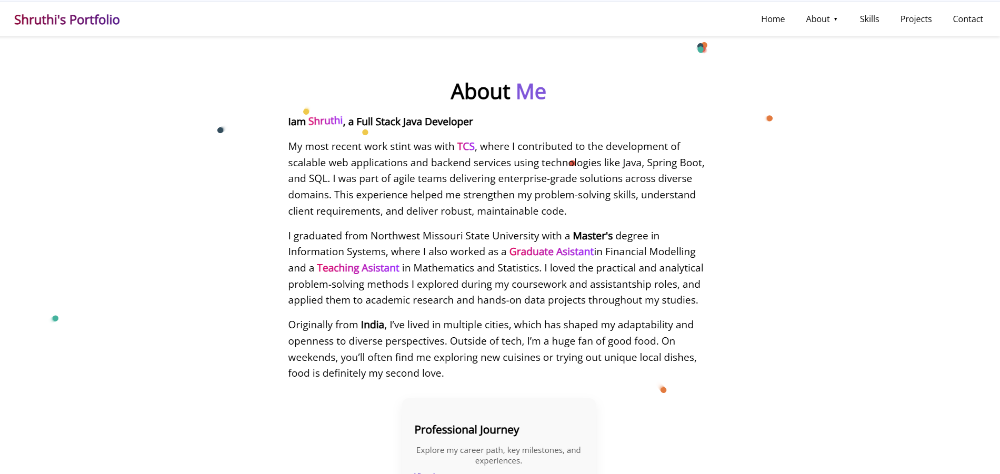
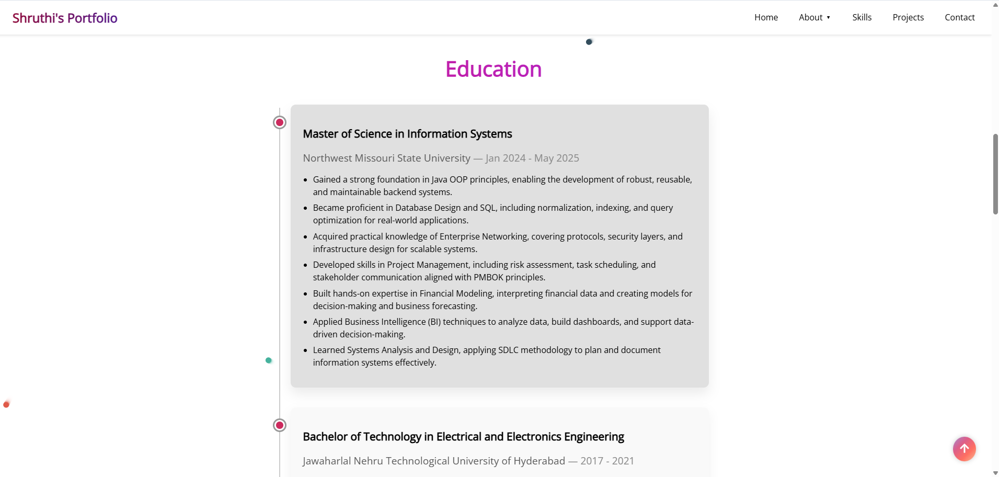
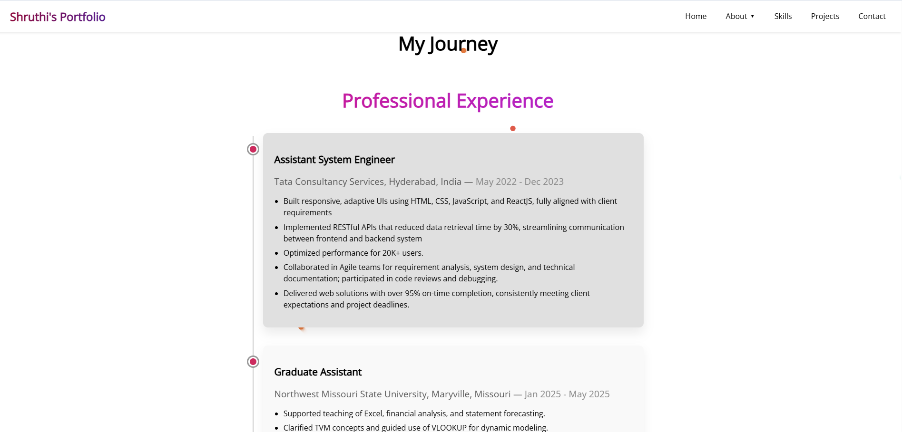
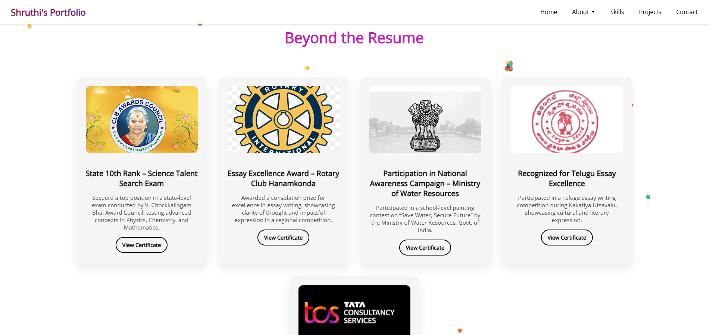

# 💼 Personal Portfolio - Shruthi

This is a modern, responsive personal portfolio website built using **React.js**. It showcases my professional experience, education, projects, skills, and achievements in a visually appealing and interactive format.

## 🔗 Live Demo


[Click here to view](https://shruthipillala.github.io/portfolio)  


## Repository:
[GitHub Repo]( https://github.com/shruthipillala/portfolio) 

---

## 🚀 Features

- ✅ Responsive design for all devices
- 🎨 Custom theme with smooth scroll and animation effects
- 🧑‍💻 Projects section with interactive cards
- 📜 About section with journey (Experience, Education, Certification)
- 🧰 Skills section tailored to Full Stack Java Development
- 🏆 Early achievements and awards
- 📞 Contact section with social media links

---

## 🛠️ Tech Stack

- **Frontend**: React.js, HTML5, CSS3, JavaScript
- **Design Tools**: CSS Modules, custom fonts, and gradient styling
- **Deployment**: GitHub Pages

---
📸 Screenshots







---

## 🧾 Getting Started ##

1. Clone the repository

```bash
git clone https://github.com/shruthipillala/portfolio.git
cd portfolio

2. Install dependencies

npm install

3. Start the development server


npm start

4. Build for production

npm run build


